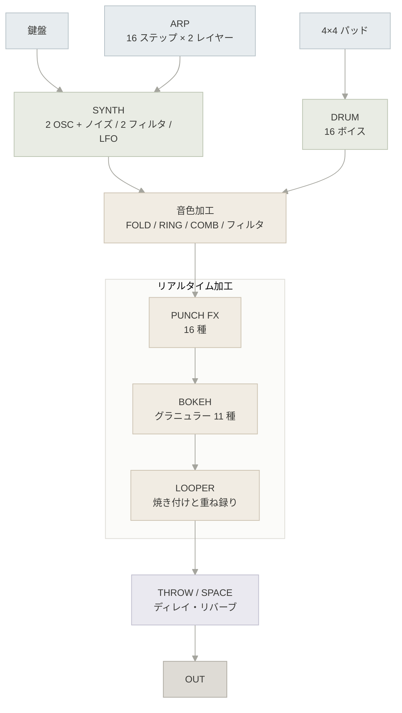

# Hebith-FX

A synthesizer and real-time effects instrument for the mobile web.

**https://shitake.github.io/hebith-fx-pages/**

| 図の色 | 種類 |
|--------|------|
| 青灰 | 演奏面 |
| 緑灰 | 音源 |
| 砂 | 加工 |
| 藤 | 空間系 |
| 濃灰 | 出力 |

| 項目 | 内容 |
|------|------|
| 使い方 | [ユーザマニュアル](https://shitake.github.io/hebith-fx-pages/manual/)(日本語 / English) |
| 動作環境 | モバイル Web(スマートフォンでの利用を想定)。タブレット・デスクトップでも動作する |
| 依存 | なし。一度開けばオフラインで動作する |
| ライセンス | [MIT](LICENSE) |
